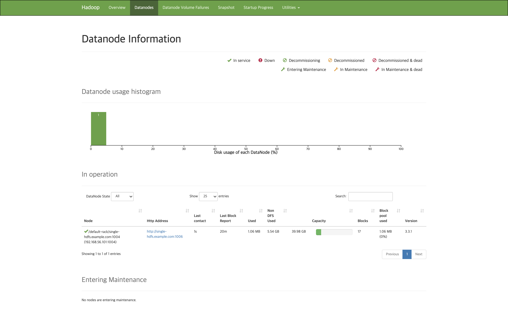
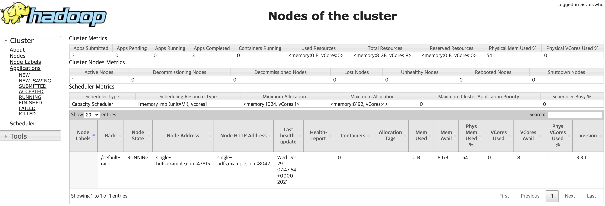
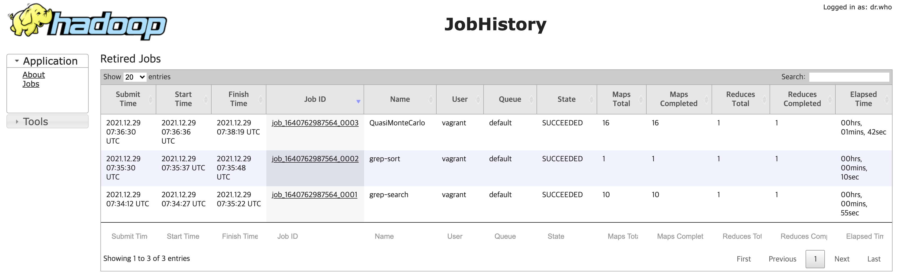

# Hadoop Single Node

Hadoop 3 with Ansible on VM

- Hadoop
- Vagrant
- VirtualBox
- Ansible

## Download Hadoop 3.3.1

Save `hadoop-3.y.z.tar.gz` in `ansible/files/dist`.

- [Hadoop Mirrors](http://www.apache.org/dyn/closer.cgi/hadoop/common/)
- Index of [/hadoop/common/hadoop-3.3.1](https://downloads.apache.org/hadoop/common/hadoop-3.3.1/)

```
cd ansible/files/dist
wget https://downloads.apache.org/hadoop/common/hadoop-3.3.1/hadoop-3.3.1.tar.gz
```

## Install Software

Build a virtual machine cluster in a local environment using Vagrant, VirtualBox, and Ansible.

- [Vagrant](https://www.vagrantup.com/downloads)
- [VirtualBox](https://www.virtualbox.org/wiki/Downloads)
- [Ansible](https://docs.ansible.com/ansible/latest/installation_guide/intro_installation.html)

---

## VM Configurations

- IP: `192.168.56.101`
- Hostname: `single-hdfs`
- FQDN: `single-hdfs.example.com`
- Hadoop Version: `3.3.1`

### Ref files

- `Vagrantfile`: [L4 ~ L7](https://github.com/rurumimic/hadoop-single-node/blob/master/Vagrantfile#L4-L7)
- `ansible/files/hadoop/core-site.xml`: [L20](https://github.com/rurumimic/hadoop-single-node/blob/master/ansible/files/hadoop/core-site.xml#L20)
- `ansible/files/hadoop/mapred-site.xml`: [L28](https://github.com/rurumimic/hadoop-single-node/blob/master/ansible/files/hadoop/mapred-site.xml#L28)

---

## Start

### Provision

```bash
vagrant up
vargant ssh
```

### Initialize HDFS Namenode

If the `/tmp/hadoop-hdfs` directory does not exist, run the following command:

```bash
sudo su - hdfs -c '/etc/hadoop/bin/hdfs namenode -format -force'
```

### Running HDFS Namenode

```bash
sudo su - hdfs -c '/etc/hadoop/bin/hdfs --daemon start namenode'
```

### Running HDFS Datanode

```bash
sudo /etc/hadoop/bin/hdfs --daemon start datanode
```

### Setting up the HDFS file system

Initialize HDFS with the following structure:

```bash
sudo su - hdfs -c '/vagrant/ansible/files/script/setup.hdfs.sh'
```

#### HDFS filesystem

```bash
sudo su - hdfs -c '/etc/hadoop/bin/hdfs dfs -ls -R /'
```

```bash
drwxrwxrwt   - mapred hadoop          0 2021-12-29 07:27 /mr-history
drwxr-x---   - mapred hadoop          0 2021-12-29 07:27 /mr-history/done
drwxrwxrwt   - mapred hadoop          0 2021-12-29 07:27 /mr-history/tmp
drwxrwxrwt   - hdfs   hadoop          0 2021-12-29 07:27 /tmp
drwxrwxrwt   - yarn   hadoop          0 2021-12-29 07:27 /tmp/logs
drwxr-xr-x   - hdfs   hadoop          0 2021-12-29 07:27 /user
drwx------   - hdfs    hadoop           0 2021-12-29 07:26 /user/hdfs
drwx------   - mapred  hadoop           0 2021-12-29 07:27 /user/mapred
drwx------   - vagrant vagrant          0 2021-12-29 07:27 /user/vagrant
drwx------   - yarn    hadoop           0 2021-12-29 07:27 /user/yarn
```

### Run YARN resource manager

```bash
sudo su - yarn -c '/etc/hadoop/bin/yarn --daemon start resourcemanager'
```

### Run YARN node manager

```bash
sudo /etc/hadoop/bin/yarn --daemon start nodemanager
```

### Running MAPRED MapReduce Job History Server

```bash
sudo su - mapred -c '/etc/hadoop/bin/mapred --daemon start historyserver'
```

---

## List of running servers

```bash
sudo jps # Java Virtual Machine Process Status Tool
```

```bash
21186 ResourceManager
19219 NameNode
21463 NodeManager
21688 Jps
19341 DataNode
21629 JobHistoryServer
```

---

## HDFS Test

### Set environment variables

```bash
export HADOOP_HOME=/etc/hadoop
export PATH=$PATH:$HADOOP_HOME/bin
```

### Check HDFS access

```bash
hdfs dfs -ls -R /
```

```bash
drwxrwxrwt   - mapred hadoop          0 2021-12-29 07:27 /mr-history
drwxr-x---   - mapred hadoop          0 2021-12-29 07:27 /mr-history/done
ls: Permission denied: user=vagrant, access=READ_EXECUTE, inode="/mr-history/done":mapred:hadoop:drwxr-x---
drwxrwxrwt   - mapred hadoop          0 2021-12-29 07:27 /mr-history/tmp
drwxrwxrwt   - hdfs   hadoop          0 2021-12-29 07:30 /tmp
drwxrwx---   - mapred hadoop          0 2021-12-29 07:30 /tmp/hadoop-yarn
ls: Permission denied: user=vagrant, access=READ_EXECUTE, inode="/tmp/hadoop-yarn":mapred:hadoop:drwxrwx---
drwxrwxrwt   - yarn   hadoop          0 2021-12-29 07:27 /tmp/logs
drwxr-xr-x   - hdfs   hadoop          0 2021-12-29 07:27 /user
drwx------   - hdfs    hadoop           0 2021-12-29 07:26 /user/hdfs
ls: Permission denied: user=vagrant, access=READ_EXECUTE, inode="/user/hdfs":hdfs:hadoop:drwx------
drwx------   - mapred  hadoop           0 2021-12-29 07:27 /user/mapred
ls: Permission denied: user=vagrant, access=READ_EXECUTE, inode="/user/mapred":mapred:hadoop:drwx------
drwx------   - vagrant vagrant          0 2021-12-29 07:27 /user/vagrant
drwx------   - yarn    hadoop           0 2021-12-29 07:27 /user/yarn
ls: Permission denied: user=vagrant, access=READ_EXECUTE, inode="/user/yarn":yarn:hadoop:drwx------
```

### Upload files

```bash
hdfs dfs -mkdir -p /user/vagrant/input
hdfs dfs -copyFromLocal $HADOOP_HOME/etc/hadoop/*.xml input
```

Confirm:

```bash
hdfs dfs -ls /user/vagrant/input
```

```bash
Found 10 items
-rw-r--r--   1 vagrant vagrant       9213 2021-12-29 07:32 /user/vagrant/input/capacity-scheduler.xml
-rw-r--r--   1 vagrant vagrant        884 2021-12-29 07:32 /user/vagrant/input/core-site.xml
-rw-r--r--   1 vagrant vagrant      11765 2021-12-29 07:32 /user/vagrant/input/hadoop-policy.xml
-rw-r--r--   1 vagrant vagrant        683 2021-12-29 07:32 /user/vagrant/input/hdfs-rbf-site.xml
-rw-r--r--   1 vagrant vagrant       1333 2021-12-29 07:32 /user/vagrant/input/hdfs-site.xml
-rw-r--r--   1 vagrant vagrant        620 2021-12-29 07:32 /user/vagrant/input/httpfs-site.xml
-rw-r--r--   1 vagrant vagrant       3518 2021-12-29 07:32 /user/vagrant/input/kms-acls.xml
-rw-r--r--   1 vagrant vagrant        682 2021-12-29 07:32 /user/vagrant/input/kms-site.xml
-rw-r--r--   1 vagrant vagrant       1158 2021-12-29 07:32 /user/vagrant/input/mapred-site.xml
-rw-r--r--   1 vagrant vagrant       1020 2021-12-29 07:32 /user/vagrant/input/yarn-site.xml
```

---

## MapReduce Test

### Add working directory permissions

```bash
sudo su - hdfs -c '/etc/hadoop/bin/hdfs dfs -chmod -R 777 /tmp/hadoop-yarn'
```

### List of tests

```bash
hadoop jar $HADOOP_HOME/share/hadoop/mapreduce/hadoop-mapreduce-examples-3.3.1.jar
```

### Run the example

```bash
hadoop jar \
$HADOOP_HOME/share/hadoop/mapreduce/hadoop-mapreduce-examples-3.3.1.jar \
grep input output 'dfs[a-z.]+'
```

### Check the result

```bash
hdfs dfs -ls output
```

```bash
Found 2 items
-rw-r--r--   1 vagrant vagrant          0 2021-12-29 07:35 output/_SUCCESS
-rw-r--r--   1 vagrant vagrant        157 2021-12-29 07:35 output/part-r-00000
```

### MapReduce result file

```bash
hdfs dfs -cat output/*
```

```bash
2       dfs.example.com
1       dfsadmin
1       dfs.replication
1       dfs.namenode.secondary.http
1       dfs.datanode.http.address
1       dfs.datanode.data.dir.perm
1       dfs.datanode.address
```

---

## Yarn Test

### Set environment variables

```bash
export YARN_EXAMPLES=/etc/hadoop/share/hadoop/mapreduce
```

### Pi Calculation Example

```bash
yarn jar $HADOOP_HOME/share/hadoop/mapreduce/hadoop-mapreduce-examples-3.3.1.jar pi 16 100000
```

### Check the value

```bash
Job Finished in 114.882 seconds
Estimated value of Pi is 3.14157500000000000000
```

---

## Web Interfaces

| Daemon                      | Web Interface           | Default HTTP port | Localhost Link                                   |
| --------------------------- | ----------------------- | ----------------- | ------------------------------------------------ |
| NameNode                    | `http://nn_host:port/`  | 9870              | [http://localhost:9870](http://localhost:9870)   |
| ResourceManager             | `http://rm_host:port/`  | 8088              | [http://localhost:8088](http://localhost:8088)   |
| MapReduce JobHistory Server | `http://jhs_host:port/` | 19888             | [http://localhost:19888](http://localhost:19888) |

---

## Check Web Interface

### NameNode



### ResourceManager



### MapReduce JobHistory Server


